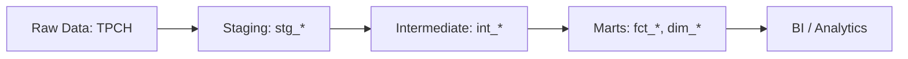

# Data-Pipeline (dbt + Snowflake)

**Project type:** Data transformation layer  
**Tools used:** dbt, Snowflake, Python  
**Data source:** Snowflake sample data (TPCH-SF1)

## Project overview

This repository contains the dbt transformation layer for an ELT pipeline that processes TPCH sample data in Snowflake. The project transforms raw data into staging, intermediate, and mart layers following analytics engineering best practices.

**Key features:**
- Multi-layered data transformations (staging → intermediate → marts)
- Automated data quality testing
- Reusable SQL macros
- Comprehensive documentation

## Data transformation flow



## Repository structure

```
├── README.md
├── dbt_project.yml          # dbt project configuration
├── packages.yml             # dbt package dependencies
├── analyses/                # Ad-hoc analyses
├── macros/                  # Reusable SQL macros (e.g., pricing.sql)
├── models/
│   ├── staging/            # Source data staging layer
│   │   ├── stg_tpch_orders.sql
│   │   ├── stg_tpch_line_items.sql
│   │   └── tpch_sources.yml
│   └── marts/              # Business logic layer
│       ├── int_order_items.sql
│       ├── int_order_items_summary.sql
│       ├── fct_order.sql
│       └── generic_test.yml
├── seeds/                   # Static CSV data files
├── snapshots/               # Slowly changing dimensions
└── tests/                   # Custom data tests
    ├── fct_orders_date_valid.sql
    └── fct_orders_discount.sql
```

## Prerequisites

- **Snowflake account** with appropriate permissions
- **Python 3.8+**
- **Git**

## Setup instructions

### 1. Clone the repository

```bash
git clone https://github.com/Nilan-1911/data_pipeline.git
cd data_pipeline
```

### 2. Set up Python environment

```bash
python -m venv env
source env/bin/activate  # On Windows: env\Scripts\activate
pip install -r requirements.txt
```

**requirements.txt:**
```txt
dbt-core>=1.5.0
dbt-snowflake>=1.5.0
```

### 3. Configure dbt profile

Create `~/.dbt/profiles.yml` (**never commit this file**):

```yaml
default:
  target: dev
  outputs:
    dev:
      type: snowflake
      account: <your_account>
      user: <your_username>
      password: "{{ env_var('SNOWFLAKE_PASSWORD') }}"
      role: <your_role>
      database: <your_database>
      warehouse: <your_warehouse>
      schema: <your_schema>
      threads: 4
      client_session_keep_alive: false
    
    prod:
      type: snowflake
      account: <your_account>
      user: <your_username>
      password: "{{ env_var('SNOWFLAKE_PASSWORD') }}"
      role: <your_role>
      database: <your_prod_database>
      warehouse: <your_warehouse>
      schema: <your_prod_schema>
      threads: 4
      client_session_keep_alive: false
```

Set your password as an environment variable:
```bash
export SNOWFLAKE_PASSWORD='your_password_here'
```

### 4. Install dbt dependencies

```bash
dbt deps
```

### 5. Run dbt commands

```bash
# Test connection
dbt debug

# Run all models
dbt run

# Run specific model
dbt run --select stg_tpch_orders

# Run tests
dbt test

# Generate and serve documentation
dbt docs generate
dbt docs serve
```

## Data models

### Staging layer (`models/staging/`)
Cleans and standardizes raw source data:
- **stg_tpch_orders**: Standardized orders data with renamed columns and type casting
- **stg_tpch_line_items**: Standardized line items data with calculated fields

### Intermediate layer (`models/marts/int_*`)
Prepares data for business logic:
- **int_order_items**: Joins orders with line items at the order-item grain
- **int_order_items_summary**: Aggregates order-level metrics from line items

### Marts layer (`models/marts/fct_*`)
Business-ready fact tables:
- **fct_order**: Complete order fact table with aggregated line item metrics

## Testing strategy

The project includes multiple testing layers:

### Generic tests (in `.yml` files)
- Uniqueness checks on primary keys
- Not-null validations on required fields
- Referential integrity between models
- Accepted value constraints

### Custom tests (`tests/`)
- **fct_orders_date_valid.sql**: Validates order dates are within acceptable ranges
- **fct_orders_discount.sql**: Ensures discount calculations are correct

Run all tests:
```bash
dbt test
```

Run specific test:
```bash
dbt test --select fct_orders_date_valid
```

## Macros

Custom macros are located in `macros/`:
- **pricing.sql**: Reusable pricing calculation logic

## Orchestration

This dbt project is orchestrated using Apache Airflow with Astronomer Cosmos. For orchestration setup and configuration, see the separate Airflow repository: (https://github.com/Nilan-1911/dbt-orchestration)

## Resources

- [dbt Documentation](https://docs.getdbt.com/)
- [dbt Best Practices](https://docs.getdbt.com/guides/best-practices)
- [Snowflake Documentation](https://docs.snowflake.com/)
- [dbt Discourse Community](https://discourse.getdbt.com/)
