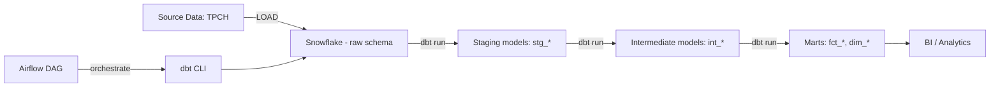

# Data Pipeline — dbt + Snowflake + Airflow

**Project type:** ELT pipeline  
**Tools used:** dbt, Snowflake, Apache Airflow, Python  
**Data source:** Snowflake sample data (TPCH-SF1)

## Project overview

This repository implements an ELT (Extract, Load, Transform) pipeline that:
1. Loads source data (TPCH-SF1 orders & line items) into Snowflake
2. Uses dbt to transform raw data into staging, intermediate, and mart layers
3. Orchestrates dbt runs using Apache Airflow

The goal is to showcase a production-style ELT pipeline with:
- Multi-layered data transformations (staging → intermediate → marts)
- Automated data quality testing
- Reusable SQL macros
- Workflow orchestration with Airflow

## High-level architecture


```mermaid
flowchart LR
  A[Source Data: TPCH] -->|LOAD| B[Snowflake - raw schema]
  B -->|dbt run| C[Staging models: stg_*]
  C -->|dbt run| D[Intermediate models: int_*]
  D -->|dbt run| E[Marts: fct_*, dim_*]
  F[Airflow DAG] -->|orchestrate| G[dbt CLI]
  G --> B
  E --> H[BI / Analytics]
```

## Repository structure

```
├── README.md
├── dbt_project.yml          # dbt project configuration
├── packages.yml             # dbt package dependencies
├── analyses/                # Ad-hoc analyses
├── macros/                  # Reusable SQL macros (e.g., pricing.sql)
├── models/
│   ├── staging/            # Source data staging layer
│   │   ├── stg_tpch_orders.sql
│   │   ├── stg_tpch_line_items.sql
│   │   └── tpch_sources.yml
│   └── marts/              # Business logic layer
│       ├── int_order_items.sql
│       ├── int_order_items_summary.sql
│       ├── fct_order.sql
│       └── generic_test.yml
├── seeds/                   # Static CSV data files
├── snapshots/               # Slowly changing dimensions
└── tests/                   # Custom data tests
    ├── fct_orders_date_valid.sql
    └── fct_orders_discount.sql
```

## Prerequisites

- **Snowflake account** with appropriate permissions
- **Python 3.8+**
- **Apache Airflow** (local or cloud)
- **Git**

## Local setup

### 1. Clone the repository

```bash
git clone https://github.com/Nilan-1911/Data-Pipeline.git
cd Data-Pipeline
```

### 2. Set up Python environment

```bash
python -m venv env
source env/bin/activate  # On Windows: env\Scripts\activate
pip install -r requirements.txt
```

**Note:** Create `requirements.txt` if it doesn't exist:
```txt
dbt-core>=1.5.0
dbt-snowflake>=1.5.0
apache-airflow>=2.5.0
astronomer-cosmos  # Optional: for dbt + Airflow integration
```

### 3. Configure dbt profile

Create `~/.dbt/profiles.yml` (**never commit this file**):

```yaml
default:
  target: dev
  outputs:
    dev:
      type: snowflake
      account: <your_account>
      user: <your_username>
      password: "{{ env_var('SNOWFLAKE_PASSWORD') }}"
      role: <your_role>
      database: <your_database>
      warehouse: <your_warehouse>
      schema: <your_schema>
      threads: 4
      client_session_keep_alive: false
```

Set your password as an environment variable:
```bash
export SNOWFLAKE_PASSWORD='your_password_here'
```

### 4. Install dbt dependencies

```bash
dbt deps
```

### 5. Run dbt models

```bash
# Run all models
dbt run

# Run tests
dbt test

# Generate documentation
dbt docs generate
dbt docs serve
```

### 6. Set up Airflow (optional)

1. Initialize Airflow database:
```bash
airflow db init
```

2. Create an admin user:
```bash
airflow users create \
    --username admin \
    --password admin \
    --firstname Admin \
    --lastname User \
    --role Admin \
    --email admin@example.com
```

3. Place your DAG file in `~/airflow/dags/`

4. Start Airflow:
```bash
airflow scheduler &
airflow webserver -p 8080
```

5. Access the UI at `http://localhost:8080`

## Testing

The project includes custom tests for data quality:

- **Date validity test** (`tests/fct_orders_date_valid.sql`): Ensures order dates are valid
- **Discount validation** (`tests/fct_orders_discount.sql`): Checks discount logic

Run all tests:
```bash
dbt test
```

Run specific tests:
```bash
dbt test --select fct_orders_date_valid
```

## Data models

### Staging layer
- `stg_tpch_orders`: Cleaned and standardized orders data
- `stg_tpch_line_items`: Cleaned and standardized line items data

### Intermediate layer
- `int_order_items`: Joins orders with line items
- `int_order_items_summary`: Aggregated order metrics

### Marts layer
- `fct_order`: Fact table for order analytics


## Resources & references

- [dbt Documentation](https://docs.getdbt.com/)
- [Snowflake Documentation](https://docs.snowflake.com/)
- [Apache Airflow Documentation](https://airflow.apache.org/docs/)
- Inspired by: *"Build an ELT Pipeline in 1 Hour (dbt, Snowflake, Airflow)"*

